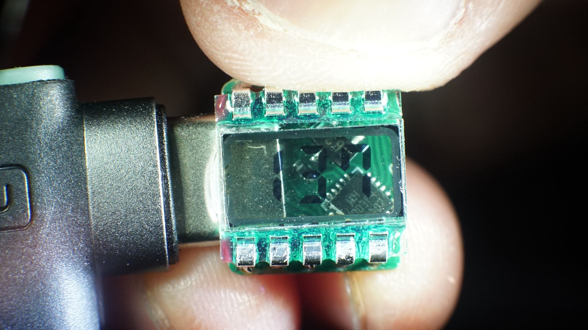
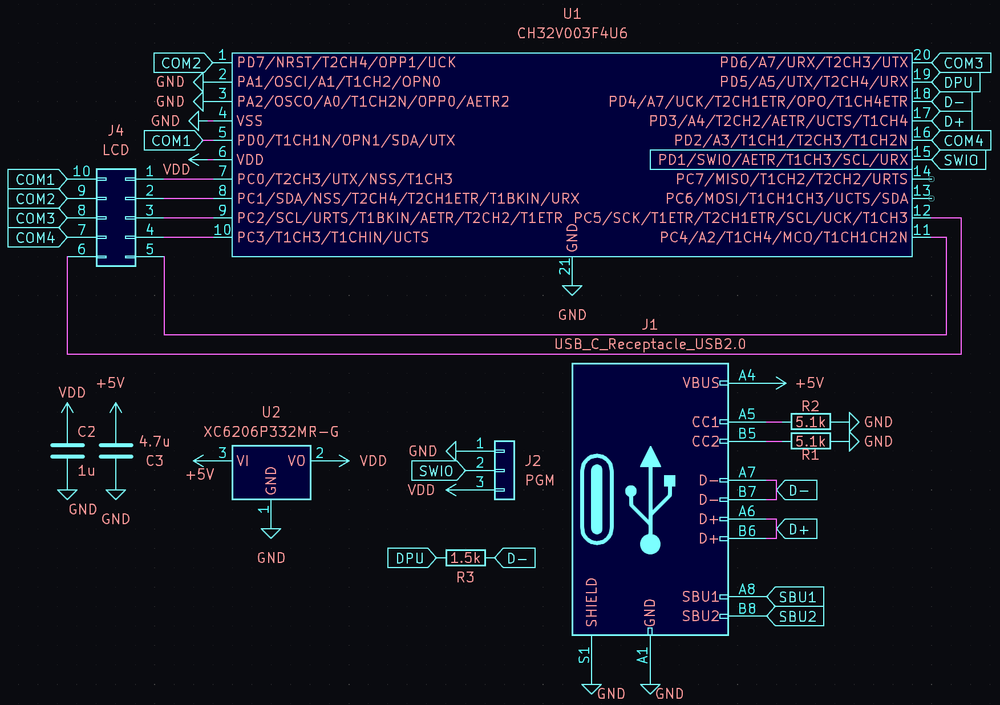
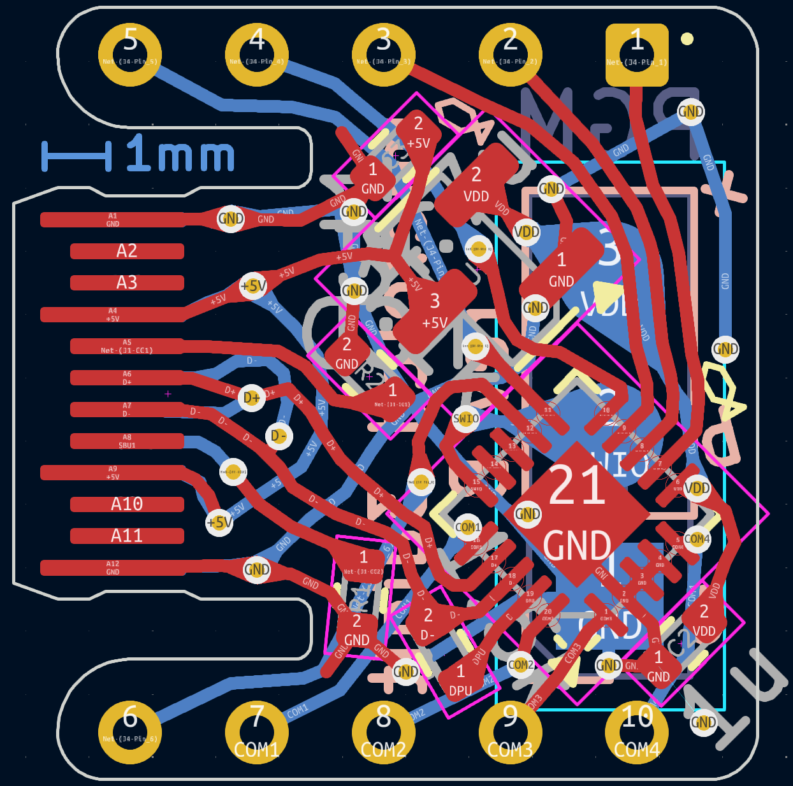
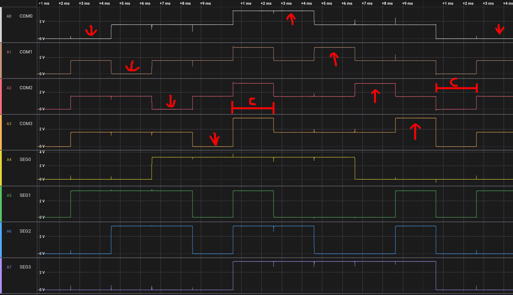
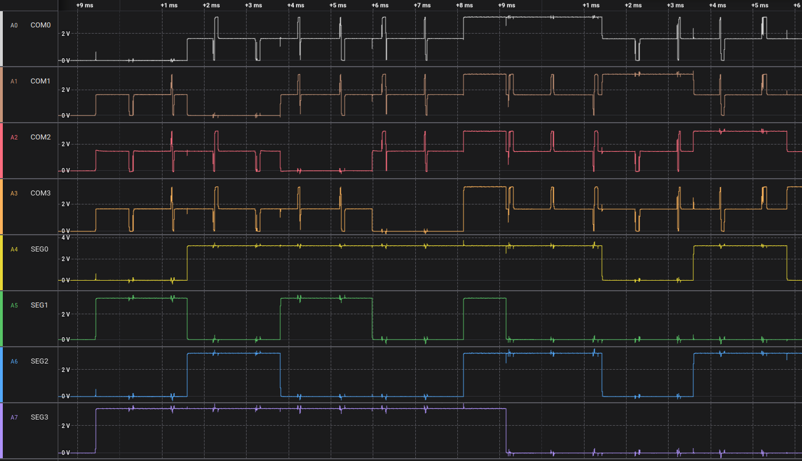
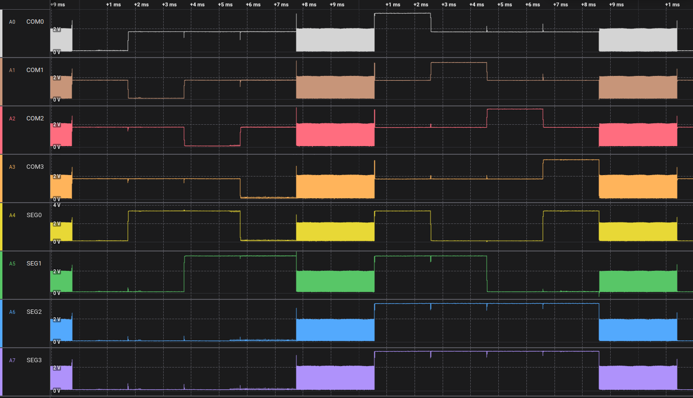
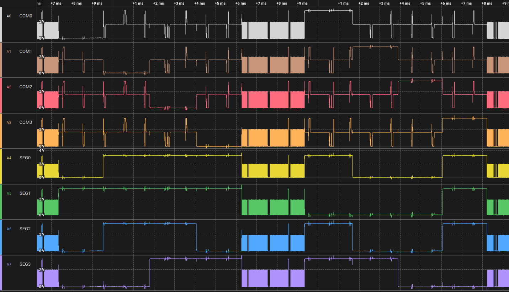

# ch32v003_3digit_lcd_usb

USB, Touch and Driver for 3-digit 7-segment LCDs on CH32V003

(Will be YT link when released)



Using a ch32v003, a 10 cent microcontroller, without USB, Touch or LCD Driving capaibilities to do all three at the same time.

## Design



The design uses the reference rv003usb pinout, simply run the ch32v003 at 3.3v with an LDO and connect it up to the USB paddle card.

Conveniently the paddle card uses the same pinout as a normal USB Connector.



The overall board uses the inside part of a USB Type C connector, but as part of the PCB, so there are the following two recommendations:

1. Your PCB should be 0.6mm thick.
2. Your PCB sohuld use ENIG finish instead of HASL, as it is possible a HASL finish could damage USB-C cables.

The ch32v003 needs no preprogramming, only access to the GND/SWIO/5V pins to flash the bootloader on.

To use this design, your LCD must be a 3V LCD and should match the following specification:


## Software

To flash on the software, you should:

 * Optionally, install the rv003usb bootloader.

Then, from either external programmer or bootloader,

 * In your desired firmware folder type `make option_write`
 * Flash with `make flash`

Appropriate firmware can be found in the firmware/ folders.  When cloning this repo, be sure to clone recursively, i.e.

```
git clone https://github.com/cnlohr/ch32v003_3digit_lcd_usb --recursive
```

or if you, forgot, cd into the folder and run:
```
git submodule update --init --recursive
```

## Waveforms

For basic LCD output, you can use a fairly simple waveform that has 10 stages.

 * Stages 0..3 = Specific COM pins are driven LOW in succession, while any segments to light are turned HIGH.
 * Stage 4 = Free time, make sure there is no voltage differential.  This also helps control contrast.
 * Stage 5..8 = Specific COM pins are driven HIGH in succession, while any segments to light are turned LOW.
 * Stage 9 = The other half of the free time for contrast.



You can see how enabling USB wrecks things up, because with USB going, it can't regulate the SEG pins to 1/2 VCC.



For touch, the output is repeatedly released from a low voltage with an internal pullup while simultaneously measuring the voltage with an ADC to obtain the touch amount.



Which looks great until USB sails its boat into it.



## Resources

 * Applicaiton Note: [NXP AN3129](https://www.nxp.com/docs/en/application-note/AN3219.pdf)
 * [ch32v003fun](https://github.com/cnlohr/ch32v003fun)
 * [rv003usb](https://github.com/cnlohr/ch32v003fun)

Search Aliexpress for "TN LCD Segment" to find these little bad boys.

## License

All code and designs may by licensed freely under the MIT/x11 License.
